# Abfahrkontrollkarten Führerscheinprüfung C1

## 1. Fahrtenschreiber

### Aufgaben vor Fahrtantritt am EG-Kontrollgerät

  
 Antwort 

- Zündung einschalten
- 3 Sekunden auf Taste [1] drücken um Schacht zu öffnen
- Fahrerkarte einstecken (Pfeil nach oben und Chip nach vorne), Klappe manuell zu machen
- Nachtrag erstellen? (Was ist seit dem letzten Eintrag passiert? Ruheitzeit, Werkstattbesuch, Abfahrtskontrolle)
- Land bestätigen bzw. einstellen

Rahmenbedingungen:

- 28 Tage lückenlose Nachweispflicht
- Nachtrag z.B. Ruhezeit, Werkstattbesuch, Abfahrtskontrolle

### Bedienung der Schalter am Fahrtenschreiber

  
 Antwort 

- Taste [1] 3 Sekunden drücken um Schacht zu öffnen
- Taste [1] kurz drücken um Tätigkeit einzustellen
  - Bereitschaft (Wenn nicht gefahren wird)
  - Ruhezeit (Wenn erholt wird, z.B. Schlaf)
  - Sonstige Tätigkeiten (z.B. Be- und Entladen)
  - Fahrt (Wenn gefahren wird)
- Taste [2] wie Taste [1]
- Taste [Return][ArrowUp][ArrowDown][OK] Menüfeld. Zum Beispiel Uhrzeit einstellen, Ausdruck machen

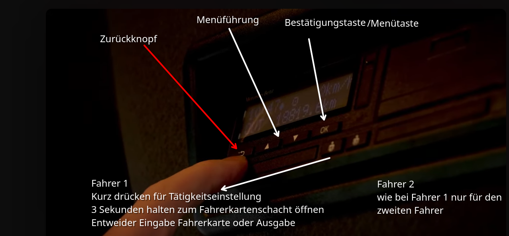

### Bedeutung der Kontrolllampen des Fahrtenschreibers; Ausfall des Gerätes

  
 Antwort 

1. Zündung an
  - Kontrolllampe zeigen -> TCO auf dem Display
  - Ausfall?
    - Doppelpunkt blinkt nicht, Sekunden würden nicht mitgezählt werden
    - Display dunkel
    - Fehlercode
    - Kontrolllampe leuchtet (TCO leuchtet gelb oder rot)
    - KM-Stand und Tacho synchron?

### Benennung der Symbole auf dem Fahrtenschreiber

  
 Antwort 

- Symbole des Fahrers:
  - X aus Hämmern:
    - Ladetätigkeiten
    - Sicherung der Ladung
    - Abfahrtskontrolle
    - Waschen
    - Papierkram
    - Reifenwechsel
  - h:
    - Ruhezeit
    - Pause
  - [/]:
    - Bereitschaft
        - als 2. Fahrer
        - warten
  - Lenkrad:
    - Lenkzeit/Fahrtzeit

- Displaysymbole:
  - Uhrzeit:
    - 15:30 Uhr -> UTC Zeit
    - 15:30* Uhr -> Ortszeit
  - Kreis mit Punkt neben der Uhrzeit -> Gerät Betriebsbereit
  - Für Personengruppen:
      - Kreis mit Punkt:
        - Betriebsart Fahrer
      - Häuschen:
        - Unternehmer
      - Werkzeig:
        - Werkstatt
      - []:
        - BAG

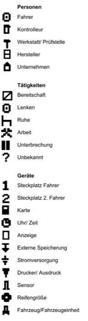

### Überprüfen eines Schaublattes bzw. eines Ausdruckes des Fahrtenschreibers (Bekommen wir ausgehändigt)

  
 Antwort 

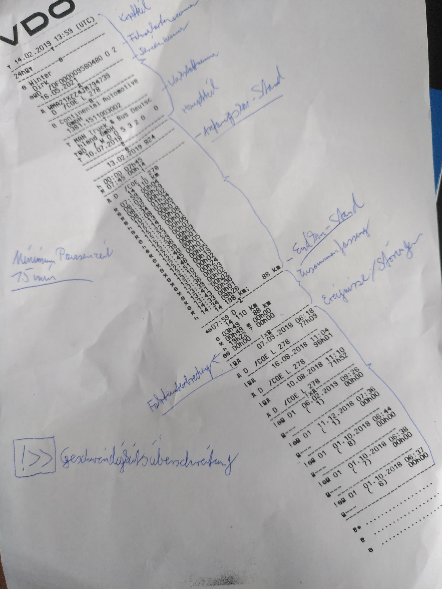

a) Wie viele km wurden gefahren?

Antwort: 88 km
- Differenz zwischen Start und Ziel
- Kann man auch in der Zusammenfassung ablesen

b) Wie lange war die Fahrtunterbrechung?

Antwort: 19h 22min
- Kann man auch in der Zusammenfassung ablesen (Symbol h) -> Bettsymbol

c) Nach wie viel Stunden wurde die erste Pause eingelegt?

Antwort: 2h 09min
- Minimale Pausenzeit beträgt 15 Minuten ansonst zählt es nicht als Pause

d) Welche Höchstgeschwindigkeit wurde gefahren bzw. wurden beim digitalen Kontrollgerät Geschwindigkeitsüberschreitungen dokumentiert?

Antwort: Es wurden keinen Geschwindigkeitsüberschreitungen dokumentiert
- Könnte man in der Ereignisliste ablesen, Symbol wäre \[!>>] (Fast-Forward-Symbol)

### Ausfüllen des Schaublattes des Fahrtenschreibers, bzw. Abmelden am Fahrtenschreiber am Ende einer Fahrt

  
 Antwort 

- Haben kein Schaublatt mehr, haben einen digitalen Fahrtenschreiber
- Fahrzeug muss sich im Stand befinden
- 3 Sekunden auf Taste [1]
- Es folgt die automatische Datenspeicherung auf der Fahrerkarte
- Land eintragen
- Ausdruck erstellen (Bestätigen)

## 2. Bremssystem

### Kontrolle des Standes der Bremsflüssigkeit

  
 Antwort 

- Motorhaube entriegeln
- Bremsflüssigkeitsbehälter auf Mindeststand prüfen, wenn etwas fehlt Werkstatt aufsuchen
- Dunkle Farbe der Bremsflüssigkeit deutet auf Feuchtigkeit hin, Werkstatt aufsuchen
- Ist ein geschlossenes System, wenn Flüssigkeit fehlt, ist ein Leck vorhanden

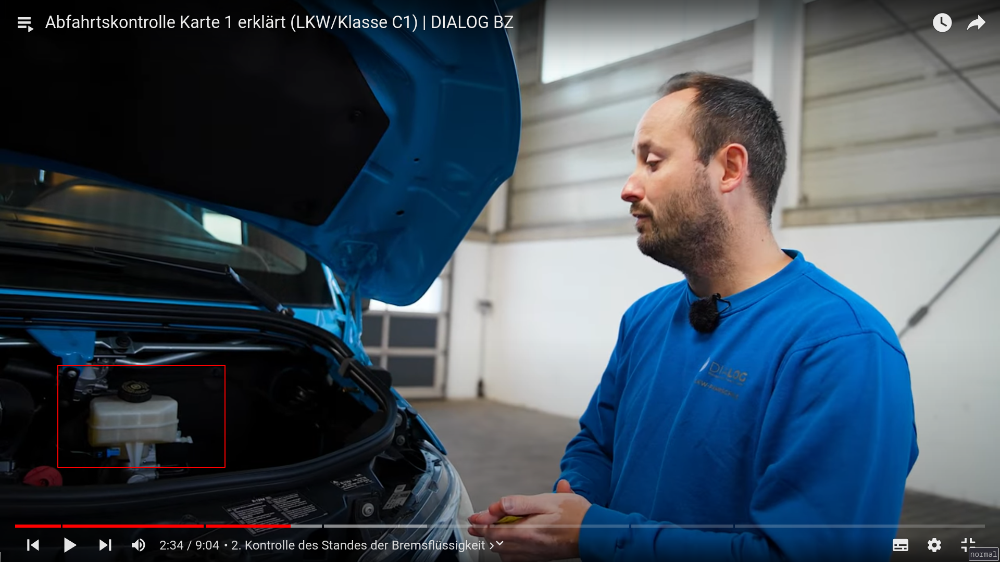

### Prüfen der Druckwarneinrichtung

  
 Antwort 

- Haben wir nicht am Sprinter (Bremsflüssigkeit zeigen im Motorraum)
- Sicherungsdruck 6 bar
- Prüfen: Zündung an, Mehrfach Bremspedal betätigen, bis unter 6 bar, Warnleuchte muss angehen [(!)]

### Sichtprüfung der Betriebs- und Feststellbremse

  
 Antwort 

- zum Rad gehen
- Betriebsbremse = Scheibenbremse beim Sprinter
- Bremsscheibe anschauen durch Felge (Löcher bei den Muttern)
  - Riefenbildung?
  - Rost?
  - blau angelaufen? (Überhitzung)
  - gebrochen?
  - Risse?
- Feststellbremse prüfen
  - Kontrollleuchte [(P)] im Armaturenbrett
  - Hebelstellung

### Prüfen, ob Pedalwege frei sind

  
 Antwort 

- Schauen ob nichts hinter dem Pedal ist (Flasche, Brotdose) Auch beim Fahrlehrer schauen
- Bei Fahrt soll auch nichts nach vorne rutschen, wenn eine Vollbremsung gemacht wird
- Ob zwei bzw. drei Pedale vorhanden sind

### Vorratsdruck aufbauen, Fahrbereitschaft feststellen

  
 Antwort 

- Wir können keinen Vorratsdruck aufbauen, wir haben eine Hydraulikbremse, die mit Bremsflüssigkeit arbeitet
- Motorhaube öffnen und Behälter mit Bremsflüssigkeit zeigen
  - Man könntes es testen indem man die Zündung und Motor anmacht und der Luftdruck aufgebaut wird, über 6,1 bar würde die Warnleuchte ausgehen
- Fahrbereitschaft feststellen -> Kontrolllampen gehen aus, die ausgehen sollen. Es gibt keine Warnmeldungen nach dem Starten im Display

### Vorrat des Frostschutzmittels prüfen (Haben wir nicht im Sprinter)

  
 Antwort 

- Haben kein Frostschutzmittel, da wir eine hydralische Bremsanlage haben
- Lufttrocknerpatrone regelmäßig wechseln (ist Granulat drin)

## 3. Reifen

### Prüfen der Reifengröße anhand der Zulassungsbescheinigung Teil 1 (Fahrzeugschein)

  
 Antwort 

* Zur Vorderachse gehen und anhand des Reifens zeigen

Beispiel:
* 205/75R 16 113R
* 205/75R 16 111R
* 205 Lauffläche in mm
* 75 prozentuale Höhe im Verhältnis zur Lauffläche
* R Radialreifen (Radial geflochten)
* 16 Felgengröße in Zoll
* 113 Tragfähigkeitsindex
* R Geschwindigkeitsindex

### Prüfen der Tragfähigkeit und der Höchstgeschwindigkeit der Reifen anhand der Zulassungsbescheinigung Teil 1 (Fahrzeugschein)

  
 Antwort 

Beispiel:
* 205/75R 16 113R
* 205/75R 16 111R

- Niedrige Zahl für Zwillingsbereifung
- Höhere Zahl für Einzelbereifung
- Anschauen am Reifen am Auto
- Vergleichen mit Zulassungsbescheinigung Teil 1
- Wenn höhere Werte auf Reifen sind, dann ist das ok
- 113 Tragfähigkeitsindex
- R Geschwindigkeitsindex

### Sichtprüfung des Sitzes der Radmuttern

  
 Antwort 

- alle da?
- alle fest? (könnte man prüfen mit Drehmomentschlüssel)
- Rostnasen an den Muttern? (Rost an den Muttern) -> Indikator für lockere Muttern, mit Drehmomentschlüssel nachziehen
- Indikatoren an den Muttern? (Farbe an den Muttern)
- Gewindegänge gleichmäßig? (außer bei Schutzkranzmuttern)
- Drehmoment gleichmäßig?

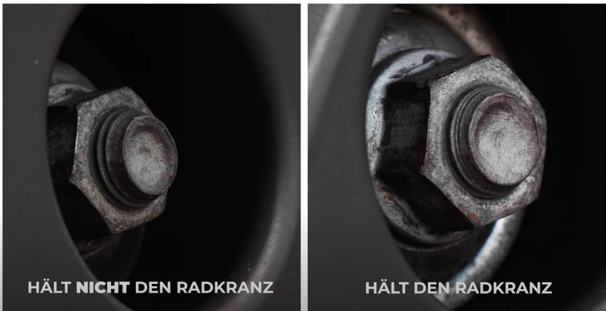

### Prüfen des Reifenzustandes (Profil, Beschädigungen, Fremdkörper) und des Reifendruckes

  
 Antwort 

- Minimale Profiltiefe: 1,6mm
  - Kann man anhand des TWI (Tread Wear Indicator) erkennen
  - oder Zollstock
  - oder Profiltiefenmesser
  - oder 1-Euro-Münze (Rand)
- Beschädigungen:
  - Risse
  - Schrauben
  - Steine zwischen Zwillingsbereifung
  - Nägel
  - Doppelbereifung anschauen, ob etwas dazwischenhängt
- Reifendruck:
  - Reifendruckkontrollsystem würde anzeigen, wenn Reifendruck zu niedrig ist
  - Sichtprüfung -> alle Reifen sehen ähnlich aus
  - Zwillingsbereifung: Reifen berühren sich nicht (zu wenig Luft, wenn sie sich berühren)

### Prüfen der Felgen auf Beschädigungen

  
 Antwort 

- Gebrochen? -> Im Bereich der Schrauben?
- Stark Gerissen?
- Große Beulen?
- Starker Rost?
- Sehr Vergammelt?

### Prüfen der Reserveradsicherung (Haben wir nicht am Sprinter)

  
 Antwort 

- Haben kein Reserverad dabei
- Sicherung 1: Reifen hängt unter dem Fahrzeig an einer Gewindestange, Schraube hält Reifen fest
- Sicherung 2: Zusätzlich ein Splint durch die Gewindestange
- Hebeeinrichtung um den Reifen runterzukurbeln
- doppelte Sicherung
- Reifen muss okay sein (Profil, Druck, Beschädigungen)

### Funktion der Lenkhilfe prüfen (Motor aus!!!) / Servolenkung

  
 Antwort 

- Linke Hand ans Lenkrad -> Druck aufbauen -> relativ schwer zu lenken!
- Danach Motor anmachen -> Lenkrad sollte leichtgängig sein
- leichtgängig?
- gleichmäßig?
- keine Geräusche?

### Lenkungsspiel prüfen (Motor an!!!)

  
 Antwort 

- Motor starten
- Fenster runter auf den Reifen gucken und am Lenkrad drehen
- Lenkspiel:
  - Maximal 2-3 cm Lenkrad drehen -> Bewegung am Rad

### Ölstand der Servolenkung prüfen (Haben wir nicht am Sprinter)

  
 Antwort 

- Fahrerhaus kippen (Mindeststand, Maximalstand)
- Wir haben eine elektrische Servolenkung -> Kann man an der Kontrolllampe prüfen (Lenkradsymbol mit Ausrufezeichen)

### Sichtprüfung der Federung (mechanische Blattfeder haben wir am Sprinter)

  
 Antwort 

- Vor das Fahrzeug stehen und schauen ob es in Waage steht
- Vorderachse und Hinterachse anschauen
- Vorderachse (Rad drehen, Motor an, damit Servolenkung funktionert und ordentlich einschlagen, Motor wieder aus)
- Blattfeder gerissen?, verrostet?, verschoben?

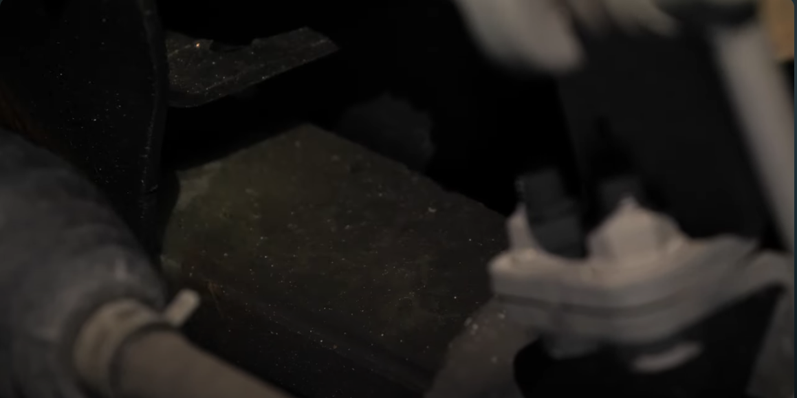

## 4. Beleuchtung

### Bremsleuchten, Kennzeichenbeleuchtung, Rückstrahler prüfen

  
 Antwort 

- jemanden beauftragen sich an das Steuer zu setzen
- Bremsleuchten: Bremspedal betätigen => Bremsleuchten prüfen (3 Stück beim Sprinter, links, rechts, oben)
- Kennzeichenbeleuchtung: Licht einschalten, Kennzeichenbeleuchtung prüfen (Hand unter Lampe des Kennzeichens halten)
- Rückstrahler: Rückstrahler prüfen (Reflektoren an der Rückseite des Fahrzeugs), schauen ob beschädigt oder verschmutzt

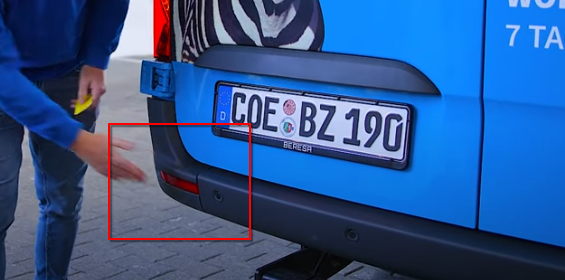

### Hupe, Lichthupe, Warnblinklicht, Seitenmarkierungsleuchten, Funktion prüfen

  
 Antwort 

- jemanden beauftragen sich an das Steuer zu setzen
- Hupe: Hupe betätigen, Hupe prüfen -> Ton muss kommen
- Lichthupe: Fernlicht einschalten bzw. Lichthupe betätigen -> Kurzes Aufleuchten der Fernlichter
- Warnblinklicht: Warnblinklicht einschalten -> Warnblinklicht prüfen (alle Blinker blinken gleichzeitig)
- Seitenmarkierungsleuchten: Seitenmarkierungsleuchten prüfen (Lichter an der Seite des Fahrzeugs)

### Standlicht, Abblendlicht, Fernlicht, Umrissleuchten vorne, Funktion prüfen

  
 Antwort 

- jemanden beauftragen sich an das Steuer zu setzen
1. Zündung an
2. Abblendlicht einschalten -> kontrollieren
3. Fernlicht einschalten -> kontrollieren
4. Umrissleuchten: Haben wir nicht am Sprinter (Würde aber seitlich am Fahrzeug sein)

### Kontrolllampen benennen oder Kontrollsysteme aktivieren und an zwei Beispielen erläutern

  
 Antwort 

Kontrolllampen: Lampe die leuchtet im Display
Kontrollsystem: Eine Lampe die leuchtet und ein Signal macht

Ein Kontrollsystem ist auch eine Kontrolllampe, zusätzlich macht es ein Geräusch

- Kontrolllampen:
  - Abblendlicht (grüne Kontrolllampe)
  - Fernlicht (blaues Fernlichtsymbol)

- Kontrollsystem:
  - Blinker links (Farbe grün und macht ein Geräusch)
  - Handbremse (Farbe rot (P) beim anfahren macht es ein Warnsignal)

### Batterie (Anschlüsse, Befestigung) prüfen

  
 Antwort 

- Kommen wir nicht ran am Sprinter (unter dem Fahrersitz)
- Hat 12 Volt, LKW hat 24 Volt 2 Batterien in Reihe geschaltet
- Flüssgkeiten rausgelaufen?
- Klemmen fest?
- Batterien fest verschraubt?
- Pole sauber? (nicht korrodiert)
- + Pol muss eine Abdeckung haben
- + Pol ist rot
- - Pol ist schwarz

### Schluss-, Umrissleuchten hinten, Funktion prüfen

  
 Antwort 

- jemanden beauftragen sich an das Steuer zu setzen
- Umrissleuchten hinten haben wir nicht (Fahrzeug ist nicht breit genug)
- Zündung an und Licht einschalten
- Schlussleuchten prüfen (Lichter hinten am Fahrzeug)
- Kein Schmutz, nichts gerissen, Birne funktioniert

## 5. Bauteile (?)

### Sichtprüfung von Kühler und Kühlleitungen, Kontrolle des Kühlflüssigkeitsstandes

  
 Antwort 

- Motorhaube öffnen
- Kühler und Kühlleitungen auf Beschädigungen prüfen
- Kühlleitung tropft?
- Unters Auto schauen ob es trocken ist
- Wasserstand prüfen (pink)
- Inhalt: Wasser mit Frostschutzmittel
- Nur bei kaltem Motor prüfen

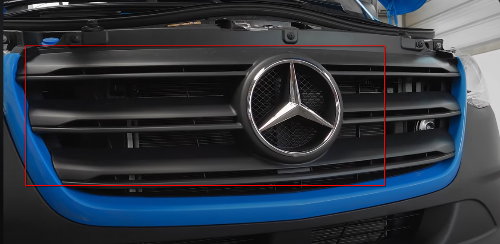
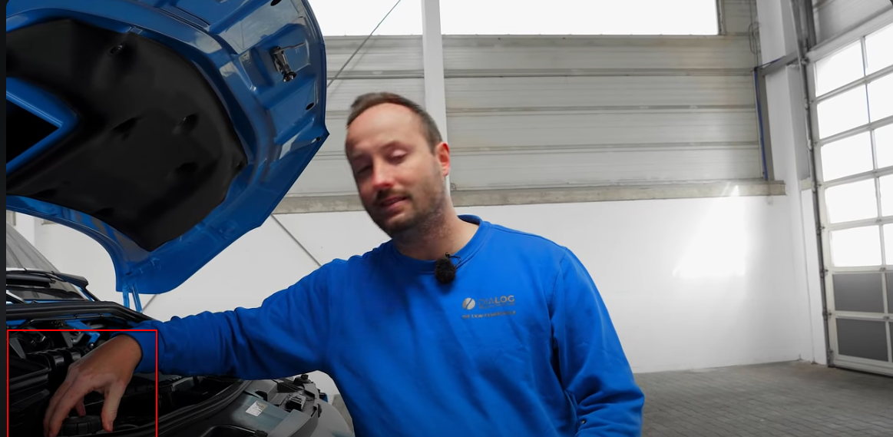
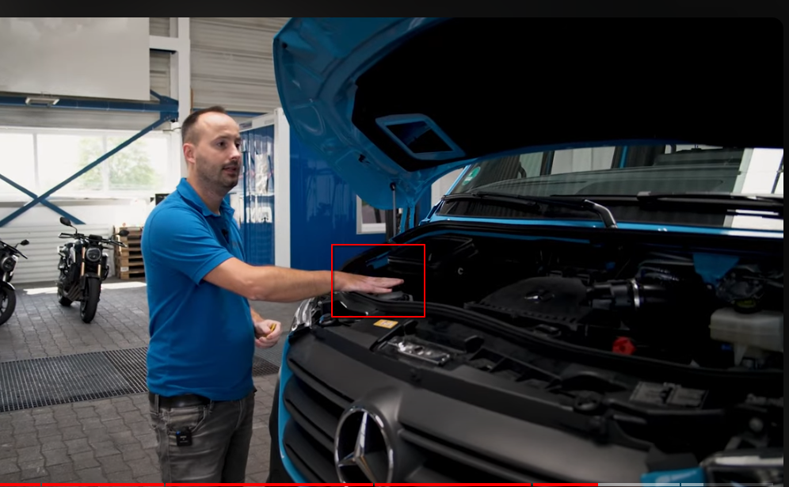

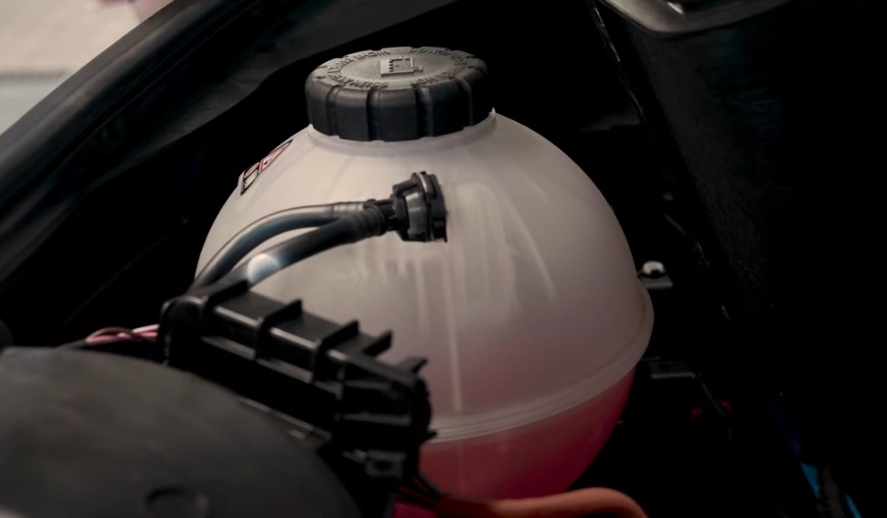

### Kontrolle des Motorölstandes

  
 Antwort 

- Motorhaube öffnen
- Motoröl nachfüllen -> spezielles Motoröl steht in der Betriebsanleitung
- nur über Menü möglich
- Menü öffnen -> Service -> Motoröl

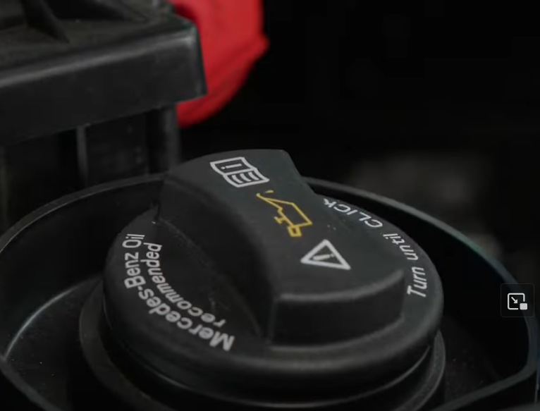

### Dichtheit der Kraftstollanlage, Kraftstoffleitungen, Kraftstoffvorrat prüfen

  
 Antwort 

- Tankdeckel anschauen (Nicht den Tankdeckel abschrauben) -> alles dicht?, trocken?
- Unters Auto schauen ob es trocken ist -> riecht?, schimmert es?
- Kraftstoffvorrat prüfen -> Anzeige im Cockpit

### Sichtprüfung des Antriebs von Nebenaggregaten (z.B. Lichtmaschine, Servo- Wasserpumpe)

  
 Antwort 

- Keilriemen prüfen
  - kommen nicht ran beim Sprinter
  - porös?
  - nicht gerissen?
  - frei von Betriebsstoffen? (Öl, Wasser)
  - Spannung? -> längste Stelle prüfen -> 90° drehbar? oder 1-2cm nachgeben

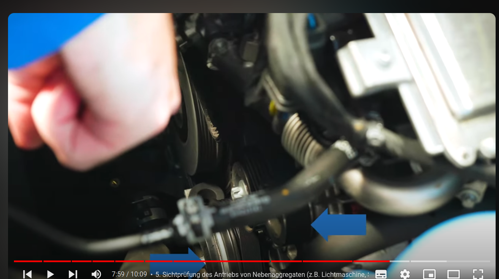

### Flüssigkeitsvorrat in Scheiben und Scheinwerferanlage kontrollieren (Scheinwerferanlage haben wir nicht)

  
 Antwort 

- Motorhaube öffnen
- Scheibenwaschanlage
  - Flüssigkeit vorhanden?
  - Frostschutzmittel vorhanden? Im Winter sollte man Frostschutzmittel verwenden
  - Düsen frei?
  - Kontrollleuchte im Cockpit an? (Symbol ist Scheibe)
  - Motorhaube öffnen und Behälter prüfen
  - Ist voll?
- Keine Flüssigkeit auf dem Boden

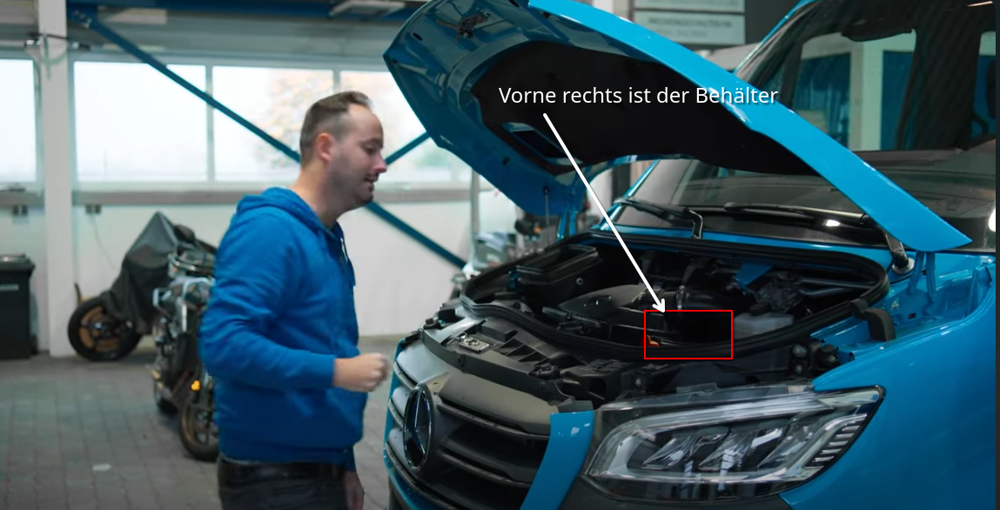
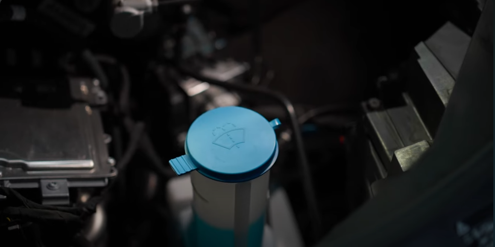

### Überprüfung der Scheibenwaschanlage und die Einstellung der Spritzdüsein

  
 Antwort 

- Testen
  - Zündung an
  - Links auf den Blinker drücken und halten
  - Kommt Wasser aus den Drüsen heraus und trifft es die Scheibe?
  - Im Winter Frostschutzmittel verwenden
- Mit Nadelspitze einstellen (nicht mit Schraubenzieher)
  - Düse nicht verstopft?
  - In die richtige Richtung?

### Überprüfung der Zustandsanzeiger für die Luftfilteranlage

  
 Antwort 

- Wir haben keine Zustandsanzeige in dem Fahrzeug
- Wird in der Inspektion gewechselt (einmal im Jahr)
- Wenn verstopft, dann Motorleistung vermindert

## 6. Fahrzeugutensilien

### Warnleuchte (Funktion), Warndreieck, Warnweste (Vorhandensein)

  
 Antwort 

1. eine Warnweste pflicht (Linke hintere Tür)
  - Prüfzeichen CE
  - sauber?
  - max 3 Waschgänge (damit die Leuchtkraft erhalten bleibt)
  - Richtige Größe
2. Warnleuchte prüfen (Linke hintere Tür)
  - Blinklicht einschalten
  - Akku prüfen -> durch Testfunktion, wenn blinkt dann noch mindestens 6 Stunden haltbar
  - Sicherer Stand?
  - Prüfzeichen CE
3. Warndreieck (seitlich rechts verstaut)
  - muss vorhanden sein (Aufmachen und reinschauen ob es überhaupt vorhanden ist)
  - Geprüft? E13
  - Hülle auf Fahrersitz packen, damit die nicht verloren geht
  - Warnleuchte prüfen
  - Warndreieck prüfen

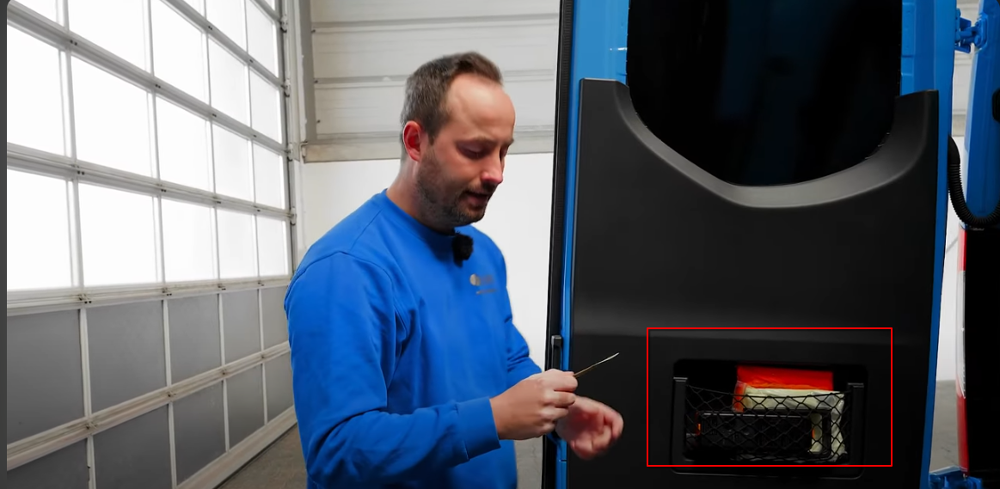
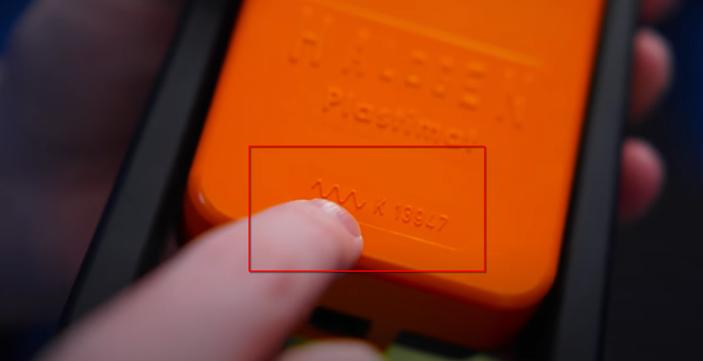

### Unterlegkeile (Anzahl, Unterbringung)

  
 Antwort 

- Mehr als 2 Achsen? -> 2 Unterlegkeile ansosten reicht einer
Unterlegkeile:
- sollten doppelt gesichert sein
- sollten unbeschädigt sein
- Bremskante haben (Metallkante vorhanden?)
- richtige Größe -> zum Reifen passend

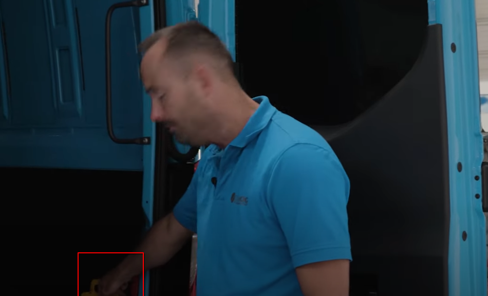
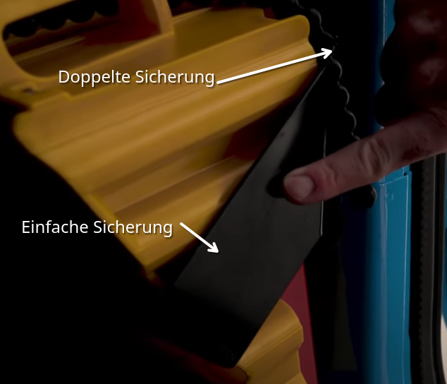

### Verbandkasten (Unterbringung)

  
 Antwort 

- Hinten, rechte Tür
- Klappe auf
- zeigen
- Packliste zeigen
- Haltbarkeitsdatum zeigen
- medizinische Maske zeigen

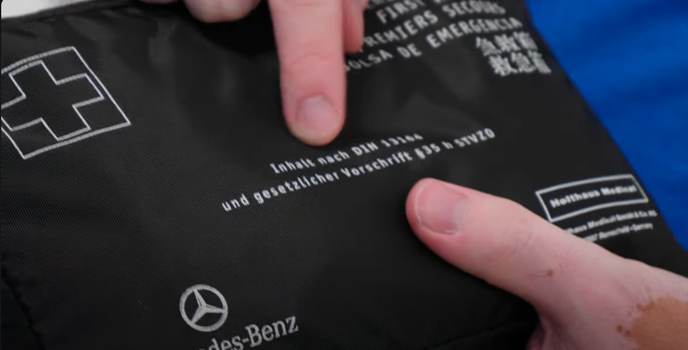

### Zustand der Scheiben und Spiegel (Saubarkeit, Beschädigungen)

  
 Antwort 

- Frontscheibe & Seitenscheiben (alle anschauen)
- Steinschläge?
- Milchig?
- Sauber?
- Blind?
- Spiegel fest?

### Sichtprüfung der Anhängerkupplung

  
 Antwort 

- Optisch prüfen -> sieht ok aus
- Verschraubung fest, nicht verbogen/schief?, nichts verrostet? (nicht anfassen, fett dran)
- Steckdose in Ordnung? (Augenscheinlich, keine Kabel raushängen?
- Öse für das Abreißseil vorhanden?
- Kappe -> Haltefunktion gegen rausdrehen
- Kupplung geschlossen?

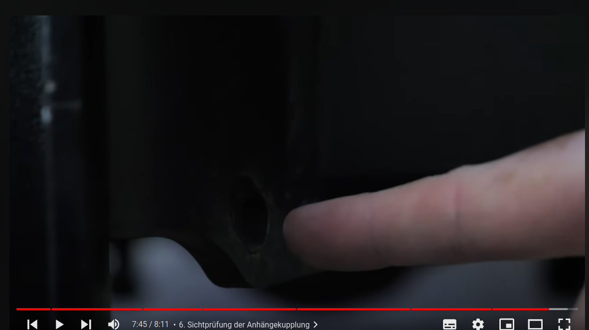

### Bordwände, Verschlüsse, Gepäckklappen, Ladeeinrichtung, Ladungssicherung (Zustandskontrolle)

  
 Antwort 

- Ladungssicherung -> Bank hinten, Tür zu, Tanköffung zu?
- Kofferraum aufmachen -> Wäre Ladung drin, dann entweder Formschlüssig oder Kraftschlüssig sichern
- Seitentür: Schienensystem für die drei Sitze -> fest?, Hebel für die Sitze -> fest? -> Bei allen nachgucken
- Bei Wohnmobil -> kein Schnee auf dem Dach
- Formschlüssig -> keine Lücken zwischen den Teilen
- Kraftschlüssig -> keine Bewegung zwischen den Teilen (z.B. Spanngurte)

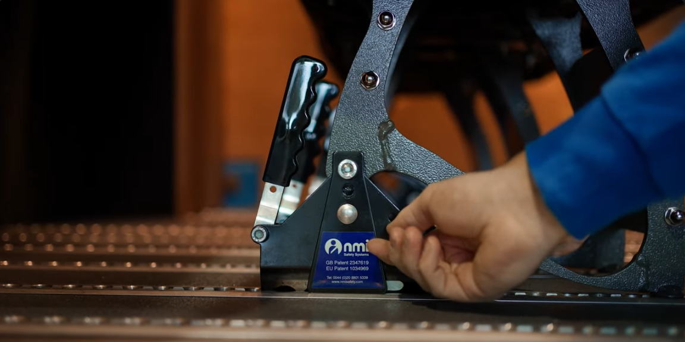

### Plane/Spriegel (Zustand und Befestigung kontrollieren, prüfen ob Plane frei von Wasser oder u.U. von Schnee und Eis)

  
 Antwort 

- Haben wir nicht am Sprinter
- Spriegel (Stangen) -> fest?
- Man könnte ein Enteisungsgerüst benutzen
- Plane -> trocken?

